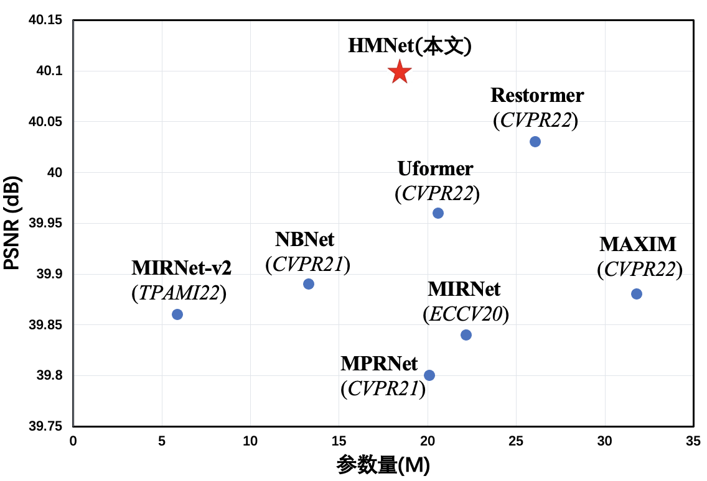
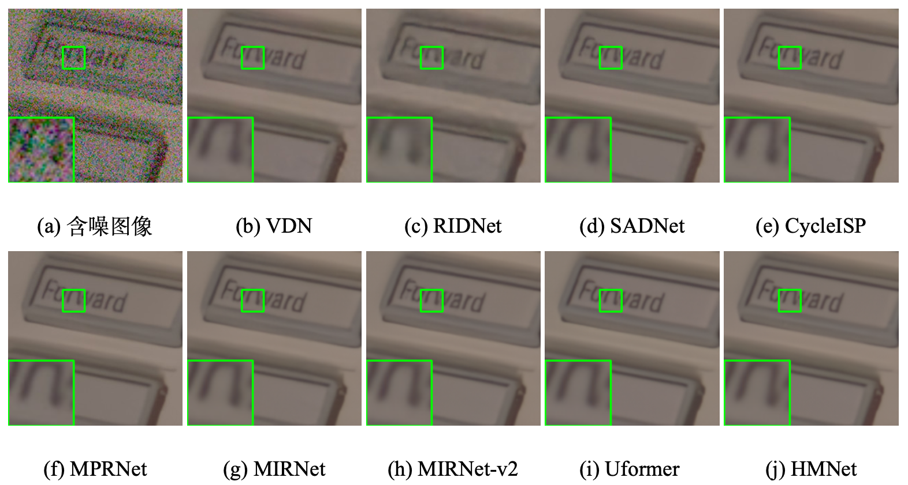
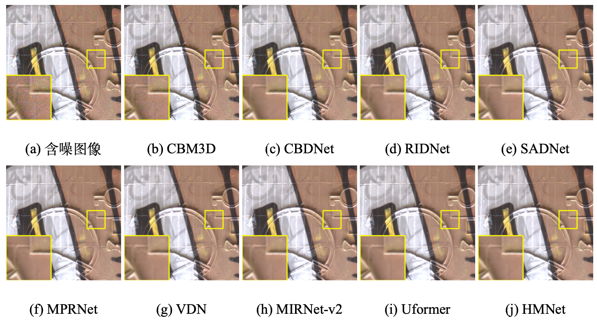
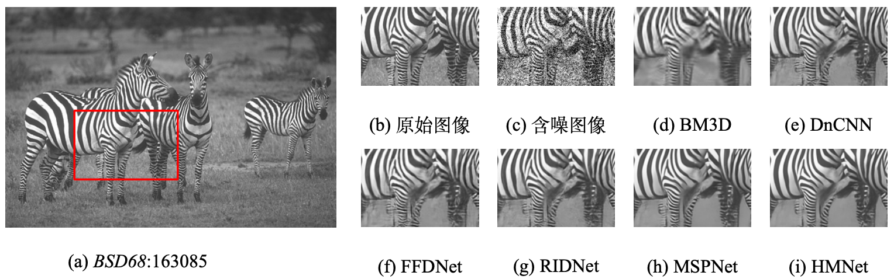
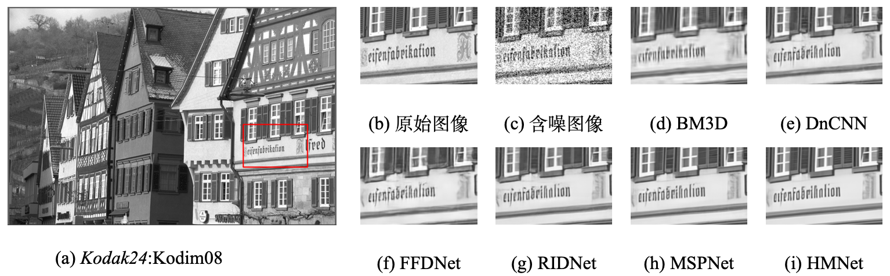

# Multi-stage image denoising method based on hybrid transformer
This repository is for HMNet
## performance
### DnD Dataset

### 
## Real Image Denoising
### SIDD Dataset

### DnD Dataset

## Synthetic image denoising

### BSD68 Dataset

### Kodak24 Dataset

The source code is coming...
